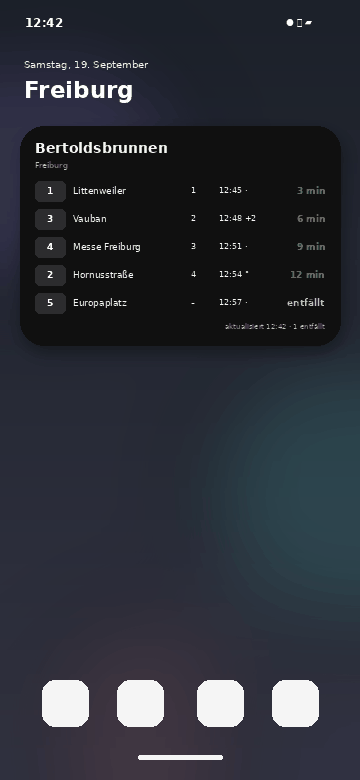

# VAG Widget for Scriptable

**Development version: v1.1.9**  
**Stable version: v1.1.2**

Scriptable iOS widget for **VAG Freiburg departures** using the EFA-BW TRIAS API, with realtime information, pinned stops, GPS selection and an offline GTFS timetable fallback.

<p align="center">
  
</p>

> The screenshot uses deterministic demo departures. It is generated by CI without a TRIAS key or live location data.

Documentation: [Architecture](docs/ARCHITECTURE.md) · [Offline GTFS](docs/GTFS.md) · [Screenshot pipeline](docs/SCREENSHOTS.md)

## What it does

The Home Screen widget shows departures for the active stop. Without a previous selection it falls back to **Bertoldsbrunnen**. Tapping the widget opens the interactive flow:

```text
Home Screen widget
  → GPS location
  → nearby-stop search
  → automatic pinned-stop selection or picker
  → active stop stored
  → optional widget refresh
  → fullscreen departures
```

Realtime departures, delays and cancellations are shown when available. Timetable-only departures remain distinguishable from realtime data.

## Installation

For a new installation, copy **`VagAbfahrten-Init.js`** to Scriptable and run it once. The installer:

1. resolves the **latest Stable GitHub Release**,
2. downloads `VagAbfahrten.js` and `VagAbfahrten-Config.js` from that exact release tag,
3. validates both managed files and their versions,
4. removes the installer after a successful installation.

Then run **`VagAbfahrten`** once and save the TRIAS requestor key when prompted. Add a medium Scriptable widget to the Home Screen and select `VagAbfahrten`; the widget parameter can stay empty.

This keeps first installation consistent with the default **Stable** update channel. Development code from `main` is installed only after explicitly switching the update channel in Config.

The TRIAS requestor key is stored in the iOS Keychain and does not need to be kept in the widget parameter.

## Offline timetable fallback

The repository includes a daily pipeline for preparing statewide MobiData BW/NVBW GTFS schedule data. TRIAS remains the primary source; if a TRIAS departure request fails, Scriptable can fall back to locally cached GTFS timetable data for configured pinned and recently used stops. Only the required shards are cached, and they can be refreshed automatically or manually. Generated source data is published separately on the `gtfs-data` branch.

See [docs/GTFS.md](docs/GTFS.md) for the data format, mapping strategy, source and attribution.

## Configuration

Run **`VagAbfahrten-Config`** in Scriptable. Changes are saved automatically when returning from a configuration submenu.

### Widget

Configure departure count, columns, widths, spacing, font sizes, immediate refresh after a location change and whether per-stop filters are applied to the Widget.

### Vollbild

Configure departure count, visible columns, relative column widths, font size and whether per-stop filters are applied to the Vollbild view. Destination text wraps to up to two lines by default; wrapping and the maximum line count can be changed in Config.

### Standort

Configure automatic selection of a pinned stop and its radius (default **200 m**). For GPS or TRIAS lookup failures, the fallback can use the last stop, **🏠 Home**, or no fallback. If Home is selected but no Home stop exists, the last active stop is used.

### Haltestellen

Stops can be pinned (“angepinnt” in the German UI) from the recently used list or found through TRIAS search. A pinned stop can have a custom display name and a role such as **Home, Work, Love, Pub, Favorite or Transfer**; custom roles can use their own emoji and label. Exactly one pinned stop can be Home.

A logical pinned stop can contain multiple TRIAS StopRefs so related platforms or stop points can be queried together. Additional StopRefs can be maintained manually.

Each pinned stop can define optional line and destination filters in **whitelist** or **blacklist** mode. Whether those filters are applied is controlled separately under Widget and Vollbild.

### Updates

Two update channels are available:

- **Stable** (default) resolves the latest manually published GitHub Release and installs runtime and Config from its exact `vX.Y.Z` tag.
- **Development** follows `main`. It resolves the current main commit SHA and downloads all managed files from that exact commit.

The updater validates downloaded files before replacing the installed scripts. A successful update relaunches Config so the newly written code becomes active. **Was ist neu?** shows Stable release notes; Development identifies the current main commit.

### Entwickleroptionen

Developer options contain:

- **Diagnose** — privacy-safe status report without key values, StopRefs, stop names or coordinates.
- **Backup & Wiederherstellung** — exports/imports personal configuration and pinned stops; secrets and transient runtime state are excluded.
- **Alle Einstellungen zurücksetzen** — restores configuration defaults and clears the derived offline cache while retaining pinned stops, recently used stops and the TRIAS key.
- **Recovery · Installation reparieren** — bypasses normal channel checks and restores runtime and Config from the exact current main commit while preserving personal data.
- **Deinstallieren · Alles löschen** — after explicit confirmation removes configuration, pinned/recent stop data, last-stop state, offline cache, update provenance, the TRIAS key and the managed scripts from Scriptable iCloud/local storage.

Personal settings are stored in **`VagAbfahrten.config.json`**. Pinned/recent stops and runtime state use Keychain entries.

## Display and status

Both compact and fullscreen views use realtime data when available. Positive delays are shown next to the departure time, timetable-only data is marked separately, and cancelled services remain visible as cancelled. Common transport/API failures are converted into concise user-facing messages.

## Updates and versioning

Runtime, Config and installer on `main` share **`APP_VERSION`**.

The two README values intentionally mean different things:

- **Development version** = `APP_VERSION` currently on `main`.
- **Stable version** = latest published Stable GitHub Release.

The PR version pipeline automatically bumps and synchronizes **only the Development version** when updater-relevant files change. It does **not** rewrite the Stable version. Stable changes only when a release is deliberately published and the README is updated accordingly.

Stable releases are created manually through the Release workflow. Merging to `main` does not automatically publish a release.

## Defaults

| Setting | Default |
| --- | --- |
| Widget departures | 5 |
| Vollbild departures | 8 |
| Automatic pinned stop | On |
| Automatic-selection radius | 200 m |
| Location fallback | Last stop |
| Immediate widget refresh | On |
| Widget filters | On |
| Vollbild filters | On |
| Update channel | Stable |

TRIAS departure requests are sized to the configured view and clamped to **1–30** results.

## Troubleshooting

If the TRIAS key is rejected, verify the Keychain value. If GPS is unavailable, check Scriptable's Location permission. With an enabled fallback, an existing last/Home stop can still be used.

For updater or installation problems use **Entwickleroptionen → Diagnose** first. **Recovery** is intended for repairing runtime/Config installation problems when the normal updater cannot recover cleanly.

## Development

Every push to `main` and every pull request runs CI on **Node 22**. It performs syntax checks, regression tests and repository/version consistency checks and uploads a JUnit XML report. Dependabot keeps GitHub Actions dependencies current.

A separate visual workflow renders an iPhone-sized widget preview whenever the runtime, Config or preview renderer changes. Pull requests receive the PNG as a workflow artifact; after changes reach `main`, the workflow refreshes `docs/assets/widget-preview.png`, which is shown at the top of this README. See [docs/SCREENSHOTS.md](docs/SCREENSHOTS.md) for the exact behavior and limitations.

Run the regression suite locally with:

```sh
node --test test/*.test.js
```

The suite covers repository/version contracts, TRIAS request/parsing behavior, platform extraction, configured result counts, location and pinned-stop logic, updater behavior and user-facing error states.

## License

MIT.
